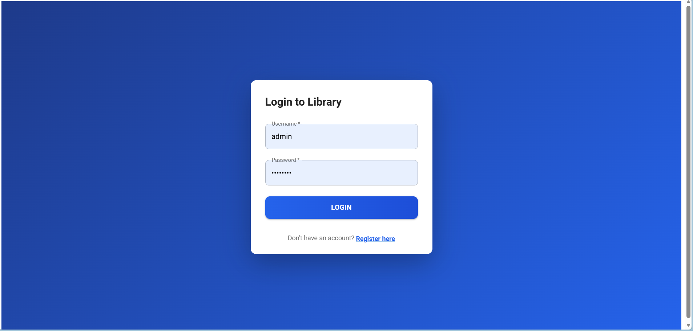
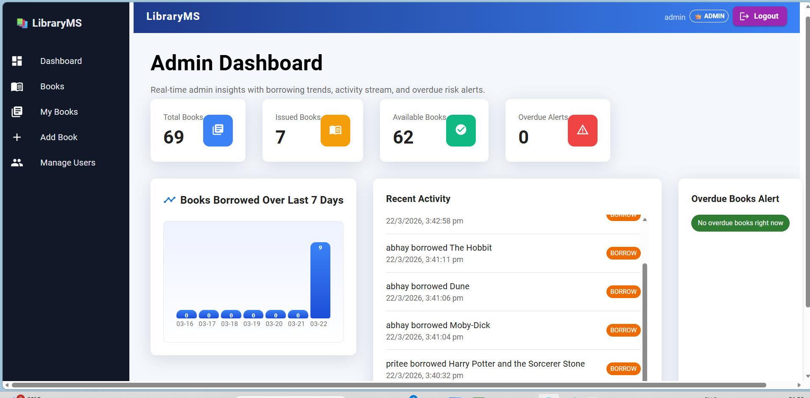
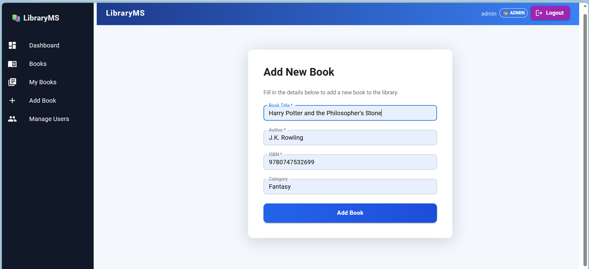

# 📚 Library Management System

A full-stack Library Management System with secure authentication, role-based access, and book lifecycle management.

## 🚀 Live Demo
https://library-management-system-t3fi.onrender.com

## 🛠️ Tech Stack
- Backend: Spring Boot, Spring Security, JWT, JPA/Hibernate
- Frontend: React
- Database: PostgreSQL (Render)
- Deployment: Docker + Render

## ✨ Features
- User authentication with JWT tokens
- Role-based access control (Admin/User)
- User registration flow
- Add / view / search / update / delete books
- Borrow / return books with due-date and fine logic
- Admin dashboard and user management views
- Secure API endpoints and validation
- Responsive frontend UI

## 🔐 Demo Credentials
Admin account:
- Username: admin
- Password: admin123

Backup admin account:
- Username: demoAdmin
- Password: demo123

## ⚙️ Local Setup
Prerequisites:
- Java 17+
- Maven 3.8+
- Node.js 18+
- PostgreSQL

1. Clone repository
2. Configure database in `backend/src/main/resources/application.properties`
3. Run backend (from project root):

```bash
cd backend
./mvnw spring-boot:run
```

4. Run frontend (new terminal):

```bash
cd frontend
npm install
npm start
```

5. Open app:
- Frontend: http://localhost:3000
- Backend API: http://localhost:8080
- Swagger UI: http://localhost:8080/swagger-ui.html

## 🧪 API Testing
- `Library.http` includes ready-to-run REST requests.
- Swagger/OpenAPI is available at `/swagger-ui.html`.

## 🖼️ Screenshots
### Login Page


### Dashboard


### Add Book Page


## 🌍 Deployment
- Backend: Render (Docker)
- Database: Render PostgreSQL
- Frontend: Render static hosting

## 📁 Repository Structure

```text
libraryms/
├─ backend/                  # Spring Boot backend
│  ├─ src/
│  ├─ pom.xml
│  └─ Dockerfile
├─ frontend/                 # React frontend
├─ screenshots/              # Project screenshots for README/demo
└─ README.md
```

## ✅ GitHub Checklist
- Root `README.md` added
- `screenshots/` folder added
- `.gitignore` covers build/dependency/env files
- Avoid committing `target/`, `node_modules/`, and `.env`

## 📝 Recommended Commit Message Style
Use clear prefixes:
- `feat: add book functionality`
- `fix: resolve database connection issue`
- `deploy: add docker support`
- `docs: improve setup instructions`
